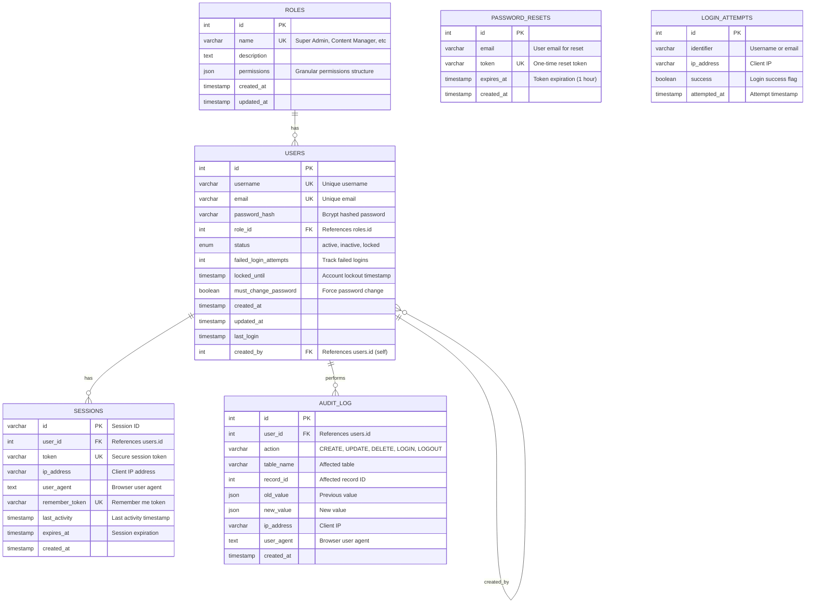

# JKTDC Admin Panel - Database Diagram

## Phase 1: Authentication & Authorization Schema

### Entity Relationship Diagram (Mermaid)

**Diagram File:** [database-auth-schema.mmd](database-auth-schema.mmd)



### Database Relationships

**Core Relationships:**
- `ROLES` → `USERS` (1:N) - Each user has one role
- `USERS` → `USERS` (1:N) - Self-referencing for created_by
- `USERS` → `SESSIONS` (1:N) - User can have multiple sessions
- `USERS` → `AUDIT_LOG` (1:N) - User performs many actions

**Independent Tables:**
- `PASSWORD_RESETS` - No FK, references users.email
- `LOGIN_ATTEMPTS` - No FK, tracking only

---

## Phase 1 Tables: Detailed Schema

### 1. ROLES Table

```sql
CREATE TABLE roles (
    id INT UNSIGNED PRIMARY KEY AUTO_INCREMENT,
    name VARCHAR(50) UNIQUE NOT NULL,
    description TEXT,
    permissions JSON NOT NULL,
    created_at TIMESTAMP DEFAULT CURRENT_TIMESTAMP,
    updated_at TIMESTAMP DEFAULT CURRENT_TIMESTAMP ON UPDATE CURRENT_TIMESTAMP,
    
    INDEX idx_name (name)
) ENGINE=InnoDB DEFAULT CHARSET=utf8mb4 COLLATE=utf8mb4_unicode_ci;
```

**Permissions JSON Structure:**
```json
{
  "users": {"create": false, "read": true, "update": false, "delete": false},
  "slider": {"create": true, "read": true, "update": true, "delete": true},
  "officials": {"create": true, "read": true, "update": true, "delete": true},
  "notifications": {"create": true, "read": true, "update": true, "delete": true},
  "events": {"create": true, "read": true, "update": true, "delete": true},
  "settings": {"read": false, "update": false},
  "logs": {"read": false}
}
```

**Default Roles:**
- Super Admin (all permissions)
- Content Manager (content management only)
- Editor (limited content editing)
- Viewer (read-only)

---

### 2. USERS Table

```sql
CREATE TABLE users (
    id INT UNSIGNED PRIMARY KEY AUTO_INCREMENT,
    username VARCHAR(50) UNIQUE NOT NULL,
    email VARCHAR(100) UNIQUE NOT NULL,
    password_hash VARCHAR(255) NOT NULL,
    role_id INT UNSIGNED NOT NULL,
    status ENUM('active', 'inactive', 'locked') DEFAULT 'active',
    failed_login_attempts INT DEFAULT 0,
    locked_until TIMESTAMP NULL,
    must_change_password BOOLEAN DEFAULT FALSE,
    created_at TIMESTAMP DEFAULT CURRENT_TIMESTAMP,
    updated_at TIMESTAMP DEFAULT CURRENT_TIMESTAMP ON UPDATE CURRENT_TIMESTAMP,
    last_login TIMESTAMP NULL,
    created_by INT UNSIGNED NULL,
    
    INDEX idx_username (username),
    INDEX idx_email (email),
    INDEX idx_status (status),
    INDEX idx_role_id (role_id),
    
    FOREIGN KEY (role_id) REFERENCES roles(id) ON DELETE RESTRICT ON UPDATE CASCADE,
    FOREIGN KEY (created_by) REFERENCES users(id) ON DELETE SET NULL ON UPDATE CASCADE
) ENGINE=InnoDB DEFAULT CHARSET=utf8mb4 COLLATE=utf8mb4_unicode_ci;
```

**Password Security:**
- Hashed with bcrypt (cost factor 12)
- Min 8 characters
- Must contain: uppercase, lowercase, number, special char

---

### 3. SESSIONS Table

```sql
CREATE TABLE sessions (
    id VARCHAR(128) PRIMARY KEY,
    user_id INT UNSIGNED NOT NULL,
    token VARCHAR(255) UNIQUE NOT NULL,
    ip_address VARCHAR(45) NOT NULL,
    user_agent TEXT,
    remember_token VARCHAR(100) UNIQUE NULL,
    last_activity TIMESTAMP DEFAULT CURRENT_TIMESTAMP ON UPDATE CURRENT_TIMESTAMP,
    expires_at TIMESTAMP NOT NULL,
    created_at TIMESTAMP DEFAULT CURRENT_TIMESTAMP,
    
    INDEX idx_user_id (user_id),
    INDEX idx_token (token),
    INDEX idx_expires_at (expires_at),
    INDEX idx_last_activity (last_activity),
    
    FOREIGN KEY (user_id) REFERENCES users(id) ON DELETE CASCADE ON UPDATE CASCADE
) ENGINE=InnoDB DEFAULT CHARSET=utf8mb4 COLLATE=utf8mb4_unicode_ci;
```

**Session Settings:**
- Lifetime: 30 minutes (inactivity timeout)
- Remember Me: 30 days
- Secure cookie flags: HttpOnly, Secure, SameSite=Strict

---

### 4. PASSWORD_RESETS Table

```sql
CREATE TABLE password_resets (
    id INT UNSIGNED PRIMARY KEY AUTO_INCREMENT,
    email VARCHAR(100) NOT NULL,
    token VARCHAR(255) UNIQUE NOT NULL,
    expires_at TIMESTAMP NOT NULL,
    created_at TIMESTAMP DEFAULT CURRENT_TIMESTAMP,
    
    INDEX idx_email (email),
    INDEX idx_token (token),
    INDEX idx_expires_at (expires_at)
) ENGINE=InnoDB DEFAULT CHARSET=utf8mb4 COLLATE=utf8mb4_unicode_ci;
```

**Reset Token:**
- Random 64-character string
- Expires after 1 hour
- One-time use only

---

### 5. LOGIN_ATTEMPTS Table

```sql
CREATE TABLE login_attempts (
    id INT UNSIGNED PRIMARY KEY AUTO_INCREMENT,
    identifier VARCHAR(100) NOT NULL,  -- username or email
    ip_address VARCHAR(45) NOT NULL,
    success BOOLEAN DEFAULT FALSE,
    attempted_at TIMESTAMP DEFAULT CURRENT_TIMESTAMP,
    
    INDEX idx_identifier (identifier),
    INDEX idx_ip_address (ip_address),
    INDEX idx_attempted_at (attempted_at)
) ENGINE=InnoDB DEFAULT CHARSET=utf8mb4 COLLATE=utf8mb4_unicode_ci;
```

**Lockout Rules:**
- 5 failed attempts = 30 minute lockout
- Tracked by IP + username/email
- Cleared on successful login

---

### 6. AUDIT_LOG Table

```sql
CREATE TABLE audit_log (
    id INT UNSIGNED PRIMARY KEY AUTO_INCREMENT,
    user_id INT UNSIGNED NOT NULL,
    action VARCHAR(50) NOT NULL,  -- CREATE, UPDATE, DELETE, LOGIN, LOGOUT
    table_name VARCHAR(50),
    record_id INT UNSIGNED,
    old_value JSON,
    new_value JSON,
    ip_address VARCHAR(45),
    user_agent TEXT,
    created_at TIMESTAMP DEFAULT CURRENT_TIMESTAMP,
    
    INDEX idx_user_id (user_id),
    INDEX idx_action (action),
    INDEX idx_table_name (table_name),
    INDEX idx_created_at (created_at),
    
    FOREIGN KEY (user_id) REFERENCES users(id) ON DELETE CASCADE ON UPDATE CASCADE
) ENGINE=InnoDB DEFAULT CHARSET=utf8mb4 COLLATE=utf8mb4_unicode_ci;
```

**Logged Actions:**
- Amermaid
erDiagram
    USERS ||--o{ SLIDER_CONTENT : "manages"
    USERS ||--o{ OFFICIALS : "manages"
    USERS ||--o{ NOTIFICATIONS : "manages"
    USERS ||--o{ EVENTS : "manages"
    USERS ||--o{ SITE_SETTINGS : "manages"
    
    SLIDER_CONTENT {
        int id PK
        varchar image_path "Path to slider image"
        varchar title "Slide title"
        varchar subtitle "Slide subtitle"
        varchar button_text "CTA button text"
        varchar button_link "CTA button URL"
        int display_order "Sort order"
        boolean is_active "Active status"
        timestamp created_at
        timestamp updated_at
        int updated_by FK "References users.id"
    }
    
    OFFICIALS {
        int id PK
        varchar name "Official name"
        varchar designation "Official position"
        varchar photo_path "Path to photo"
        int display_order "Sort order"
        boolean is_active "Active status"
        timestamp created_at
        timestamp updated_at
        int updated_by FK "References users.id"
    }
    
    NOTIFICATIONS {
        int id PK
        text content "Notification content"
        varchar icon "FontAwesome icon class"
        boolean is_active "Active status"
        date display_date "Display date"
        timestamp created_at
        timestamp updated_at
        int updated_by FK "References users.id"
    }
    
    EVENTS {
        int id PK
        varchar title "Event title"
        text description "Event description"
        date event_date "Event date"
        varchar event_month "Extracted month"
        int event_day "Extracted day"
        boolean is_active "Active status"
        timestamp created_at
        timestamp updated_at
        int updated_by FK "References users.id"
    }
    
    SITE_SETTINGS {
        int id PK
        varchar setting_key UK "Unique setting key"
        text setting_value "Setting value"
        varchar setting_type "text, json, boolean, etc"
        text description "Setting description"
        timestamp updated_at
        int updated_by FK "References users.id"
    }
```

**Content Relationships:**
- All content tables reference `USERS.id` via `updated_by` FK
- Tracks who last modified each content item
- Supports audit trail for content changes────────────────────────┤    │ • content               │
│ • id (PK)               │    │ • icon                  │
│ • title                 │    │ • is_active             │
│ • description           │    │ • display_date          │
│ • event_date            │    │ • created_at            │
│ • event_month           │    │ • updated_at            │
│ • event_day             │    │ • updated_by (FK)       │
│ • is_active             │    └──────────────────────────┘
│ • created_at            │
│ • updated_at            │    ┌──────────────────────────┐
│ • updated_by (FK)       │    │     SITE_SETTINGS        │
└──────────────────────────┘    ├──────────────────────────┤
                                 │ • id (PK)               │
                                 │ • setting_key (UNIQUE)  │
        All updated_by           │ • setting_value (TEXT)  │
        fields reference         │ • setting_type          │
        USERS.id                 │ • description           │
                                 │ • updated_at            │
                                 │ • updated_by (FK)       │
                                 └──────────────────────────┘
```

---

## Database Indexes Strategy

### Performance Indexes (Already Included):

**Fast Lookups:**
- `users.username` - Login queries
- `users.email` - Email lookups, password resets
- `sessions.token` - Session validation
- `roles.name` - Role checks

**Filtering & Sorting:**
- `users.status` - Active user queries
- `users.role_id` - Permission checks
- `audit_log.created_at` - Log queries
- `login_attempts.attempted_at` - Cleanup old attempts

**Foreign Keys:**
- All FK columns auto-indexed for JOIN performance

---

## Migration Order

**Correct order to avoid FK constraint errors:**

1. ✅ `roles` (no dependencies)
2. ✅ `users` (depends on roles)
3. ✅ `sessions` (depends on users)
4. ✅ `password_resets` (no FK, but references users.email)
5. ✅ `login_attempts` (no FK, independent)
6. ✅ `audit_log` (depends on users)

---

## Initial Seed Data

### Default Roles:

```php
// Super Admin
[
    'name' => 'Super Admin',
    'description' => 'Full system access',
    'permissions' => json_encode([
        'users' => ['create' => true, 'read' => true, 'update' => true, 'delete' => true],
        'slider' => ['create' => true, 'read' => true, 'update' => true, 'delete' => true],
        'officials' => ['create' => true, 'read' => true, 'update' => true, 'delete' => true],
        'notifications' => ['create' => true, 'read' => true, 'update' => true, 'delete' => true],
        'events' => ['create' => true, 'read' => true, 'update' => true, 'delete' => true],
        'settings' => ['read' => true, 'update' => true],
        'logs' => ['read' => true]
    ])
]

// Content Manager
[
    'name' => 'Content Manager',
    'description' => 'Manage all content except users and settings',
    'permissions' => json_encode([
        'users' => ['create' => false, 'read' => true, 'update' => false, 'delete' => false],
        'slider' => ['create' => true, 'read' => true, 'update' => true, 'delete' => true],
        'officials' => ['create' => true, 'read' => true, 'update' => true, 'delete' => true],
        'notifications' => ['create' => true, 'read' => true, 'update' => true, 'delete' => true],
        'events' => ['create' => true, 'read' => true, 'update' => true, 'delete' => true],
        'settings' => ['read' => false, 'update' => false],
        'logs' => ['read' => false]
    ])
]

// Editor
[
    'name' => 'Editor',
    'description' => 'Edit notifications and events only',
    'permissions' => json_encode([
        'users' => ['create' => false, 'read' => false, 'update' => false, 'delete' => false],
        'slider' => ['create' => false, 'read' => true, 'update' => false, 'delete' => false],
        'officials' => ['create' => false, 'read' => true, 'update' => false, 'delete' => false],
        'notifications' => ['create' => true, 'read' => true, 'update' => true, 'delete' => false],
        'events' => ['create' => true, 'read' => true, 'update' => true, 'delete' => false],
        'settings' => ['read' => false, 'update' => false],
        'logs' => ['read' => false]
    ])
]

// Viewer
[
    'name' => 'Viewer',
    'description' => 'Read-only access',
    'permissions' => json_encode([
        'users' => ['create' => false, 'read' => false, 'update' => false, 'delete' => false],
        'slider' => ['create' => false, 'read' => true, 'update' => false, 'delete' => false],
        'officials' => ['create' => false, 'read' => true, 'update' => false, 'delete' => false],
        'notifications' => ['create' => false, 'read' => true, 'update' => false, 'delete' => false],
        'events' => ['create' => false, 'read' => true, 'update' => false, 'delete' => false],
        'settings' => ['read' => false, 'update' => false],
        'logs' => ['read' => false]
    ])
]
```

### First Admin User:

```php
[
    'username' => 'admin',
    'email' => 'admin@jktdc.com',
    'password_hash' => password_hash('Admin@123', PASSWORD_BCRYPT, ['cost' => 12]),
    'role_id' => 1,  // Super Admin
    'status' => 'active',
    'must_change_password' => true  // Force password change on first login
]
```

---

## Database Size Estimates

**Phase 1 (Auth only):**
- ~1 MB (empty tables)
- ~10 MB (100 users + 1 year of logs)

**Phase 2 (With content):**
- ~50 MB (with images metadata, not actual files)

**File Storage (uploads/):**
- ~500 MB - 2 GB (actual images)

**Total:** ~60 MB - 2.1 GB for complete system

---

## Backup Strategy

**Automated Daily Backups:**
```bash
# Database backup
mysqldump -u root -p jktdc_admin > backup_$(date +%Y%m%d).sql

# Weekly full backup (database + uploads)
tar -czf backup_$(date +%Y%m%d).tar.gz backup.sql ../storage/uploads/
```

**Retention:**
- Daily backups: Keep 7 days
- Weekly backups: Keep 4 weeks
- Monthly backups: Keep 12 months

---

**Document Version:** 1.0  
**Last Updated:** December 18, 2025  
**Status:** Phase 1 - Authentication Schema
